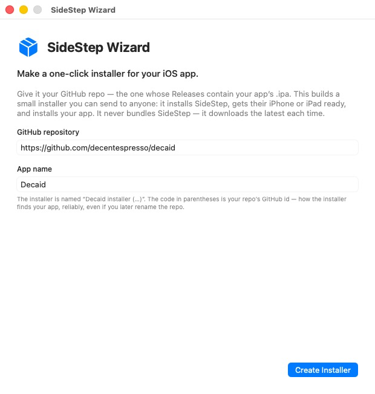
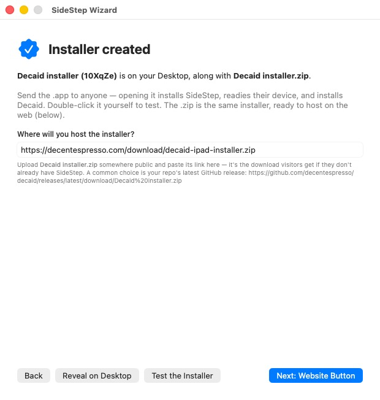
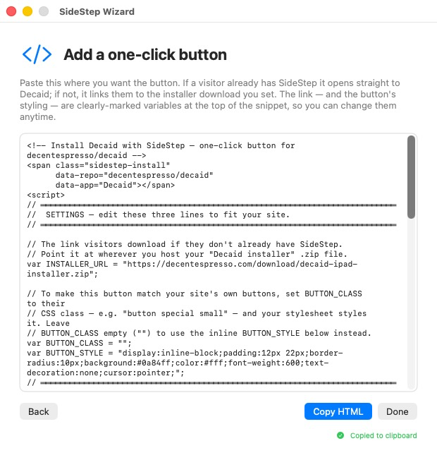

# SideStep Wizard

**SideStep Wizard** lets you hand *anyone* a one-click installer for your iOS app — **no Xcode, and no developer account on their end**. Point it at your app's GitHub repo once, and it builds a small installer you can send to people or link from your website. Opening it installs [SideStep](https://johnbuckman.github.io/SideStep/), gets their iPhone or iPad ready, and installs your app.

**[⬇ Download SideStep Wizard](https://github.com/johnbuckman/SideStepWizard/releases/latest/download/SideStepWizard.dmg)**
— notarized `.dmg`, macOS 14 (Sonoma) or newer, Apple Silicon.

It never bundles a copy of SideStep — the installer **downloads the latest SideStep** at run time, so nobody is ever stuck on a stale version.

> 🌐 **[Visit the SideStep Wizard site →](https://johnbuckman.github.io/SideStepWizard/)** for the live one-click-button demo.

## How it works

### 1. Point it at your GitHub repo

Enter the repo whose Releases hold your app's `.ipa`, and an app name. The wizard looks up the repo's immutable GitHub id — no URL shortener, nothing to register — so the installer keeps finding your app even if you later rename the repo.

### 2. It builds the installer — and a .zip to host

Click **Create Installer** and two files land on your Desktop: the installer app (`<app> installer (…).app`) and a `<app> installer.zip`. Send the app to anyone, or double-click it yourself to test. The `.zip` is the same installer, ready to host on the web — tell the wizard where you'll put it, and that becomes the download visitors get if they don't already have SideStep.

### 3. Copy a one-click button for your website

The wizard hands you ready-to-paste HTML. The download link and the button's styling are clearly-marked variables at the top (`INSTALLER_URL`, `BUTTON_CLASS`, `BUTTON_STYLE`) — set `BUTTON_CLASS` to your site's own button class and it matches your design. If a visitor already has SideStep, the button opens straight to your app; if not, it downloads the installer that walks them through setup first.

## The one-click button

The wizard's HTML drops a single **Install with SideStep** button on your page. There's a live example on the [SideStep Wizard site](https://johnbuckman.github.io/SideStepWizard/) that installs **Magnatune** (a music player): if you already have SideStep it opens straight to Magnatune; if not, it offers the Magnatune installer, which installs SideStep first and walks you through setup.

## What your recipients get

Opening the installer walks them through everything, verifying each step for real over USB:

1. **Gets SideStep.** Downloads the latest notarized SideStep and installs it (or updates an older copy in place).
2. **Connects** their iPhone or iPad over USB and waits for **Trust This Computer**.
3. **Turns on Developer Mode** (iOS 16+), surviving the reboot.
4. **Installs your app** — hands off to SideStep, which shows a confirm window; they tap Install, then trust the developer once under Settings ▸ General ▸ VPN & Device Management.

From then on, SideStep keeps the app signed and updated in the background over Wi-Fi — so a sideloaded app behaves like a normal, permanently-installed one.

---

SideStep Wizard is part of [SideStep](https://johnbuckman.github.io/SideStep/) — a small macOS menu-bar app that installs iOS apps onto your own device using your own Apple ID. It is signed with an Apple Developer ID and notarized by Apple.

**[← Visit the SideStep site](https://johnbuckman.github.io/SideStep/)**
